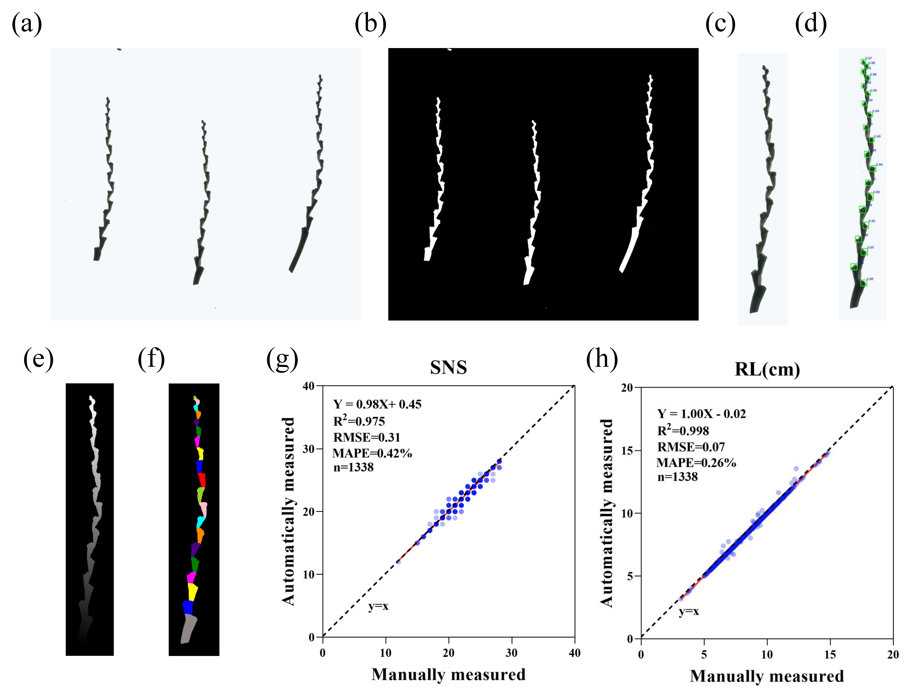

# RachisSeg: Automated Rachis Phenotyping Pipeline


## Introduction
- RachisSeg is a high-throughput, automated phenotyping pipeline designed to segment rachis internodes and quantitatively analyze rachis traits in wheat.
- By integrating deep learning networks with traditional image analysis algorithms, RachisSeg offers precise measurements, reducing the labor and errors associated with manual phenotyping.
- RachisSeg is based on [Faster R-CNN: Towards Real-Time Object Detection with Region Proposal Networks](https://ieeexplore.ieee.org/document/7485869)

 
## Requirements:  
```angular2
torch==1.12.0
detectron2==0.6
numpy==1.26.0
opencv-python==4.8.1.78
scikit-image==0.19.2
skfmm==1.5.3
matplotlib==3.5.1
scipy==1.10.1
```
## Installation

### Clone the Repository: 
```
git clone https://github.com/Jiang-Phenomics-Lab/RachisSeg.git
cd RachisSeg
```

### Create and Activate a Virtual Environment (Optional but Recommended): 
```
python -m venv venv
source venv/bin/activate  # For Windows users: `venv\Scripts\activate`
```

### Install Dependencies: 
```
pip install -r requirements.txt
```

## Code Structure
All codes were written in python.

**coco_merge.py** : Merge of multiple coco formated json file.

**cropRachis.py** : Crop individual rachis from original scanned images.

**evaluator.py** : Evaluation of trained model.

**rachis_prediction.py** : Prediction of rachis node and extraction of rachis phenotype.

**rachis_train.py** : Train of rachis node objective detection.

**register_dataset.py** : Split rachis dataset and register the dataset.

## Quick Start

- Using the Pre-trained Model: If you want to use the pre-trained model directly, download the .pth file from the following link and run rachis_prediction.py: [RachisSeg_model](https://1drv.ms/u/c/6e511ec9eedb20ec/EanHFrk7nSlNu-aLhvQvgcYBTbPEzUyAO_CiAzinqSTlog?e=4a0cFo.)

- Retraining the Model: If you want to retrain the model, follow this quick start guide:

### 1)Prepare the Rachis Image Dataset: 

Collect and organize rachis image data, ensuring high image quality and accurate annotations.

Use register_dataset.py to split and register the dataset.

```
python register_dataset.py
```

### 2) Training RachisSeg


Run the training script:

```
python rachis_train.py
```

### 3) Running RachisSeg

Use the trained model to make predictions by running rachis_prediction.py:
```
python rachis_prediction.py
```

## Flowchart

Rachis phenotyping pipeline (RachisSeg) for measurement of rachis traits.



## Examples

Segmentation of rachis internodes from three wheat varieties revealed distinct morphologies.


**Contact**
For questions or support, please contact: rxlu@genetics.ac.cn
